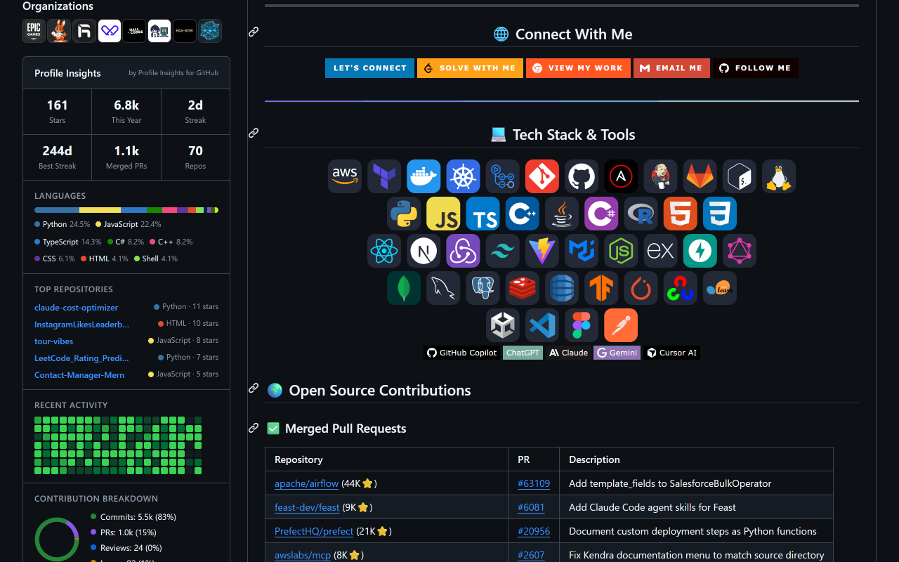
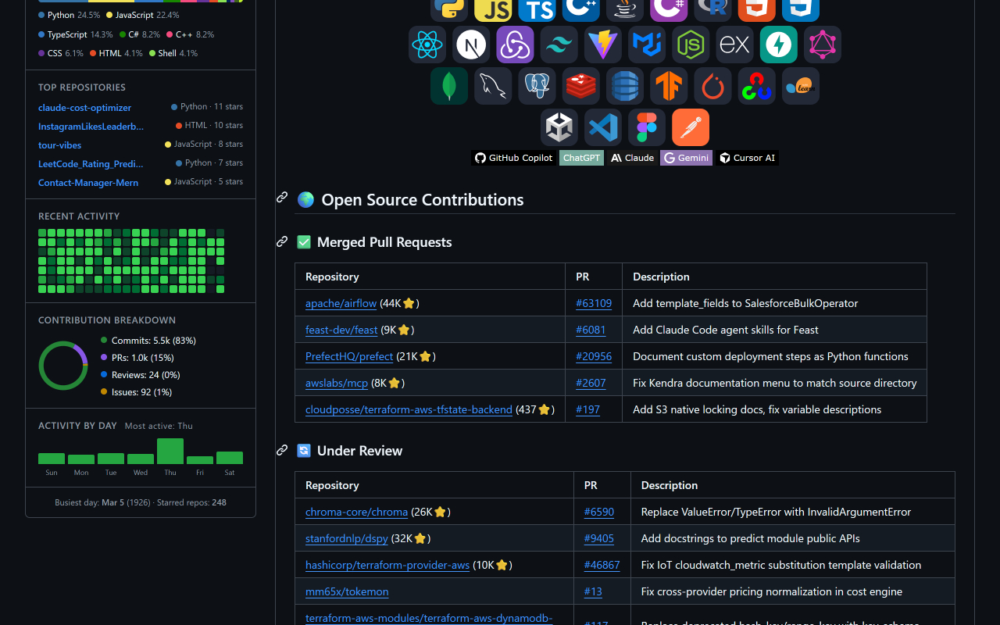

# GitScope

[](https://chromewebstore.google.com/detail/gitscope/fndaanihifimmlnmkjdmjbbkbdajolff)
[](LICENSE)
[](src/manifest.json)
[](https://sagargupta16.github.io/GitScope/)

> Browser extension + web tools for GitHub profile insights - contribution streaks, language breakdown, PR stats, profile comparison, and leaderboards.

## Screenshots

<p align="center">
  
</p>

<p align="center">
  
</p>

## Features

### Chrome Extension

- **Stats Grid** - Total stars, yearly contributions, current/longest streak, merged PRs, repository count
- **Coding Personality** - Badge like "Builder", "Reviewer", or "Collaborator" based on contribution mix
- **Quick Insights** - Avg contributions per active day, velocity trend, own/fork ratio
- **Language Breakdown** - Color-coded bar chart and legend showing language distribution
- **Top Repositories** - Top 5 repos by stars with language and star count
- **Activity Heatmap** - Compact 20-week contribution heatmap with Less/More legend
- **Contribution Donut** - Commits, PRs, reviews, and issues breakdown chart
- **Activity by Day** - Bar chart showing which day of the week you're most active
- **Repo Growth Timeline** - Bar chart showing repository creation history by year
- **Profile Comparison** - Compare any profile against your own stats
- **Dark Theme** - Automatically adapts to GitHub's light/dark theme
- **Caching** - 5-minute TTL to avoid redundant API calls

### Website ([sagargupta16.github.io/GitScope](https://sagargupta16.github.io/GitScope/))

- **Compare Tool** - Side-by-side GitHub profile comparison with head-to-head scoring
- **Leaderboard** - Rank yourself against everyone you follow (stars, repos, followers)
- **Full Stats Mode** - Sign in for contributions, streaks, PRs, personality, and velocity

## Installation

### Chrome Web Store (Recommended)

Install directly from the [Chrome Web Store](https://chromewebstore.google.com/detail/gitscope/fndaanihifimmlnmkjdmjbbkbdajolff).

### Chrome (Developer Mode)

1. Clone and build:
   ```bash
   git clone https://github.com/Sagargupta16/GitScope.git
   cd GitScope
   npm install
   npm run build
   ```
2. Open `chrome://extensions` in Chrome
3. Enable **Developer mode** (top right)
4. Click **Load unpacked** and select the `dist/` folder
5. Click the extension icon and click **"Sign in with GitHub"**

## How It Works

```
User visits github.com/<username>
    |
    v
Content Script (content.js)
    | detects profile page
    v
Background Worker (background.js)
    | sends GraphQL query to api.github.com
    | (parameterized variables - no injection)
    v
Dashboard (dashboard.js + charts.js)
    | builds panel with stats, charts, heatmap
    v
Injected into GitHub sidebar
    | cached for 5 minutes per profile
```

**Authentication** uses GitHub OAuth via a Cloudflare Worker (`worker/`). The worker holds the client secret server-side and exchanges the auth code for a token. No secrets in the extension code.

## Project Structure

```
GitScope/
  src/                       # Chrome extension source
    manifest.json            # Extension manifest (Manifest V3)
    css/insights.css         # Dashboard styles (GitHub theme-aware)
    html/popup.html          # Extension popup (OAuth sign in/out)
    icons/                   # Extension icons (16/32/48/128px + SVG)
    js/
      content.js             # Entry point (profile detection, SPA nav)
      background.js          # Service worker (API calls, avoids CORS)
      api.js                 # GitHub GraphQL queries (parameterized)
      charts.js              # Pure CSS/SVG chart rendering + analytics
      dashboard.js           # Panel construction and injection
      storage.js             # Chrome storage + caching helpers
      utils.js               # Utility functions
      popup.js               # Popup OAuth management
      auth-callback.js       # OAuth callback token capture
  website/                   # Landing page + web tools (React + TS)
    src/
      pages/                 # Landing, Compare, Leaderboard, Privacy
      components/            # Header, Footer
      lib/                   # GitHub API, analytics, auth utilities
    vite.config.ts           # Builds to docs/ for GitHub Pages
  worker/                    # Cloudflare Worker (OAuth token exchange)
    index.js                 # Handles extension + web OAuth flows
    wrangler.toml            # Wrangler config
  docs/                      # Built website (deployed to GitHub Pages)
  build.js                   # esbuild bundler for extension
  package.json
```

## Tech Stack

### Extension

- **Manifest V3** - Latest Chrome extension API
- **Vanilla JS** - Zero runtime dependencies
- **esbuild** - Fast bundler (src/ -> dist/ in <1s)
- **GitHub GraphQL API** - Single query fetches all profile data
- **CSS Custom Properties** - GitHub's theme variables for automatic light/dark

### Website

- **React 19** + **TypeScript** - Component-based UI
- **Vite** - Build tool with HMR
- **Tailwind CSS v4** - Utility-first styling
- **React Router v7** - Client-side routing
- **GitHub REST + GraphQL APIs** - Hybrid auth (basic stats without login, full stats with)

### Infrastructure

- **Cloudflare Workers** - Serverless OAuth token exchange
- **GitHub Pages** - Static site hosting
- **GitHub Actions** - CI/CD for extension releases + website deployment

## Privacy

- Token stored locally (Chrome storage for extension, localStorage for website)
- Client secret stored server-side on Cloudflare Worker
- API responses cached locally for 5 minutes
- No analytics, no tracking, no telemetry
- Source code is fully open and auditable

See [PRIVACY.md](PRIVACY.md) for the full privacy policy.

## Development

```bash
# Extension
npm install
npm run build        # Build to dist/
npm run watch        # Watch mode

# Website
cd website
pnpm install
pnpm dev             # Dev server at localhost:5173
pnpm build           # Build to docs/

# Worker
cd worker
npx wrangler dev     # Local dev server
npx wrangler deploy  # Deploy to Cloudflare
```

## Contributing

See [CONTRIBUTING.md](CONTRIBUTING.md) for guidelines.

## License

[MIT](LICENSE)
